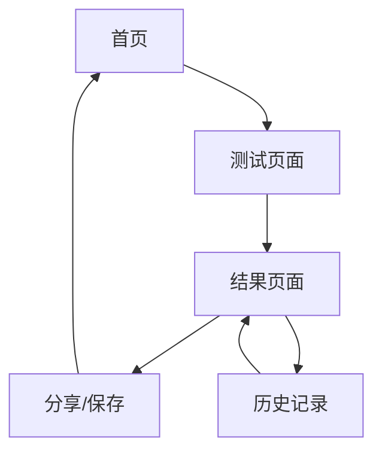

## 1. 产品概述
一个有趣的宠物MBTI性格测试小程序，通过15个左右的问题帮助主人了解狗狗的性格特征。系统会根据回答自动分析并生成个性化的宠物性格报告。

- 目标用户：宠物主人、爱宠人士
- 产品价值：增进宠物主人对狗狗性格的了解，提供有趣的互动体验

## 2. 核心功能

### 2.1 用户角色
| 角色 | 注册方式 | 核心权限 |
|------|----------|----------|
| 访客用户 | 无需注册 | 进行测试、查看结果 |
| 注册用户 | 邮箱/手机号注册 | 保存测试历史、分享结果 |

### 2.2 功能模块
宠物MBTI测试小程序包含以下主要页面：
1. **首页**：欢迎界面、测试介绍、开始测试按钮。
2. **测试页面**：问题展示、选项选择、进度显示。
3. **结果页面**：性格分析、MBTI类型展示、特征描述。
4. **历史记录**：过往测试结果、对比分析（注册用户）。

### 2.3 页面详情
| 页面名称 | 模块名称 | 功能描述 |
|----------|----------|----------|
| 首页 | 欢迎区域 | 展示小程序标题、可爱的宠物图片、简短的测试介绍。 |
| 首页 | 开始测试 | 点击按钮进入测试页面，可选择是否登录。 |
| 测试页面 | 问题展示 | 逐题显示15个性格相关问题，包含图片和文字描述。 |
| 测试页面 | 选项选择 | 提供4个选项供用户选择，支持单选。 |
| 测试页面 | 进度条 | 显示当前题目序号和总进度。 |
| 结果页面 | 性格类型 | 展示狗狗的MBTI性格类型（如：ENFP、ISTJ等）。 |
| 结果页面 | 特征分析 | 详细描述该性格类型的特点、行为表现。 |
| 结果页面 | 分享功能 | 生成分享图片或链接，支持社交媒体分享。 |
| 历史记录 | 测试列表 | 显示历史测试时间和对应的性格结果。 |
| 历史记录 | 对比分析 | 展示多次测试结果的对比图表。 |

## 3. 核心流程
用户操作流程：
1. 用户访问首页，了解测试内容
2. 点击开始测试，进入测试页面
3. 依次回答15个性格问题
4. 系统根据答案计算MBTI类型
5. 展示个性化性格分析报告
6. 可选择保存结果或分享

## 4. 用户界面设计

### 4.1 设计风格
- **主色调**：温暖的橙色（#FF8C42）和柔和的蓝色（#6ECBF5）
- **按钮样式**：圆润的3D按钮，带有阴影效果
- **字体**：可爱圆润的无衬线字体，标题18-24px，正文14-16px
- **布局风格**：卡片式布局，圆角设计，大量留白
- **图标风格**：手绘风格的宠物图标和表情符号

### 4.2 页面设计概览
| 页面名称 | 模块名称 | UI元素 |
|----------|----------|--------|
| 首页 | 欢迎区域 | 顶部放置可爱的狗狗插画，使用渐变背景，标题采用手写体字体。 |
| 测试页面 | 问题卡片 | 中央显示问题，背景为淡米色，选项为彩色圆形按钮。 |
| 结果页面 | 性格展示 | 大号字体显示MBTI类型，配以对应的宠物插画和颜色编码。 |
| 历史记录 | 时间轴 | 垂直时间轴设计，每个测试结果用不同颜色的小图标标记。 |

### 4.3 响应式设计
- 采用移动端优先设计，适配手机屏幕
- 支持触摸滑动操作
- 图片和文字自适应不同屏幕尺寸
- 横竖屏切换时保持布局稳定