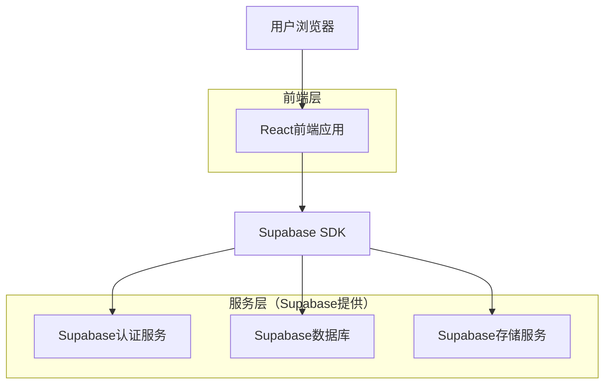
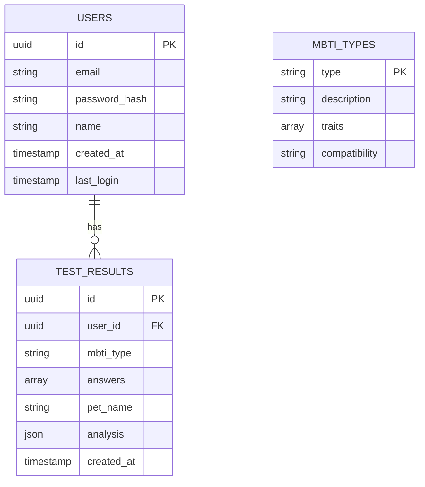

## 1. 架构设计



## 2. 技术描述

- **前端**：React@18 + TailwindCSS@3 + Vite
- **初始化工具**：vite-init
- **后端**：Supabase（BaaS平台）
- **数据库**：PostgreSQL（Supabase提供）
- **部署**：Vercel/Netlify（静态前端）

## 3. 路由定义

| 路由 | 用途 |
|------|------|
| / | 首页，展示欢迎界面和测试介绍 |
| /quiz | 测试页面，显示问题和收集答案 |
| /result | 结果页面，展示MBTI性格分析 |
| /history | 历史记录页面，查看过往测试结果 |
| /login | 登录页面，用户身份验证 |
| /register | 注册页面，新用户注册 |

## 4. API定义

### 4.1 核心API

**提交测试结果**
```
POST /api/submit-result
```

请求参数：
| 参数名 | 参数类型 | 是否必需 | 描述 |
|--------|----------|----------|------|
| answers | array | 是 | 用户答案数组，包含15个选项 |
| pet_name | string | 否 | 宠物名字 |
| user_id | uuid | 否 | 用户ID（如果已登录） |

响应参数：
| 参数名 | 参数类型 | 描述 |
|--------|----------|------|
| mbti_type | string | MBTI性格类型（如：ENFP） |
| analysis | object | 性格分析详情 |
| result_id | uuid | 测试结果ID |

示例：
```json
{
  "answers": [1, 3, 2, 4, 2, 1, 3, 2, 4, 1, 3, 2, 1, 4, 2],
  "pet_name": "小白",
  "user_id": "123e4567-e89b-12d3-a456-426614174000"
}
```

**获取测试结果**
```
GET /api/result/:result_id
```

**获取用户历史记录**
```
GET /api/user/:user_id/history
```

## 5. 数据模型

### 5.1 数据模型定义



### 5.2 数据定义语言

**用户表（users）**
```sql
-- 创建用户表
CREATE TABLE users (
    id UUID PRIMARY KEY DEFAULT gen_random_uuid(),
    email VARCHAR(255) UNIQUE NOT NULL,
    password_hash VARCHAR(255) NOT NULL,
    name VARCHAR(100) NOT NULL,
    created_at TIMESTAMP WITH TIME ZONE DEFAULT NOW(),
    last_login TIMESTAMP WITH TIME ZONE
);

-- 创建索引
CREATE INDEX idx_users_email ON users(email);
CREATE INDEX idx_users_created_at ON users(created_at DESC);
```

**测试结果表（test_results）**
```sql
-- 创建测试结果表
CREATE TABLE test_results (
    id UUID PRIMARY KEY DEFAULT gen_random_uuid(),
    user_id UUID REFERENCES users(id) ON DELETE CASCADE,
    mbti_type VARCHAR(4) NOT NULL,
    answers INTEGER[] NOT NULL,
    pet_name VARCHAR(50),
    analysis JSONB NOT NULL,
    created_at TIMESTAMP WITH TIME ZONE DEFAULT NOW()
);

-- 创建索引
CREATE INDEX idx_test_results_user_id ON test_results(user_id);
CREATE INDEX idx_test_results_created_at ON test_results(created_at DESC);
CREATE INDEX idx_test_results_mbti_type ON test_results(mbti_type);
```

**MBTI类型表（mbti_types）**
```sql
-- 创建MBTI类型表
CREATE TABLE mbti_types (
    type VARCHAR(4) PRIMARY KEY,
    description TEXT NOT NULL,
    traits JSONB NOT NULL,
    compatibility JSONB,
    created_at TIMESTAMP WITH TIME ZONE DEFAULT NOW()
);

-- 插入初始数据
INSERT INTO mbti_types (type, description, traits) VALUES
('ENFP', '外向直觉情感感知型', '["活泼好动", "好奇心强", "容易兴奋", "喜欢社交"]'),
('ISTJ', '内向感觉思维判断型', '["稳重可靠", "有规律", "忠诚守护", "谨慎小心"]'),
('ESFP', '外向感觉情感感知型', '["爱玩爱闹", "享受当下", "友善亲和", "适应力强"]'),
('INTJ', '内向直觉思维判断型', '["独立思考", "有主见", "冷静分析", "目标明确"]');
```

## 6. MBTI推理逻辑

### 6.1 评分算法
```javascript
// MBTI评分逻辑
function calculateMBTI(answers) {
  const scores = {
    E: 0, I: 0,  // 外向 vs 内向
    N: 0, S: 0,  // 直觉 vs 感觉
    F: 0, T: 0,  // 情感 vs 思维
    P: 0, J: 0   // 感知 vs 判断
  };
  
  // 根据答案计算各维度得分
  answers.forEach((answer, index) => {
    // 问题1-4：E/I维度
    if (index < 4) {
      if (answer <= 2) scores.E += answer;
      else scores.I += (5 - answer);
    }
    // 问题5-8：N/S维度
    else if (index < 8) {
      if (answer <= 2) scores.N += answer;
      else scores.S += (5 - answer);
    }
    // 问题9-12：F/T维度
    else if (index < 12) {
      if (answer <= 2) scores.F += answer;
      else scores.T += (5 - answer);
    }
    // 问题13-15：P/J维度
    else {
      if (answer <= 2) scores.P += answer;
      else scores.J += (5 - answer);
    }
  });
  
  // 确定MBTI类型
  let mbti = '';
  mbti += scores.E > scores.I ? 'E' : 'I';
  mbti += scores.N > scores.S ? 'N' : 'S';
  mbti += scores.F > scores.T ? 'F' : 'T';
  mbti += scores.P > scores.J ? 'P' : 'J';
  
  return mbti;
}
```

## 7. Supabase配置

### 7.1 访问权限设置
```sql
-- 授予匿名用户基本读取权限
GRANT SELECT ON mbti_types TO anon;
GRANT SELECT ON test_results TO anon;

-- 授予认证用户完整权限
GRANT ALL PRIVILEGES ON users TO authenticated;
GRANT ALL PRIVILEGES ON test_results TO authenticated;
GRANT ALL PRIVILEGES ON mbti_types TO authenticated;

-- 设置行级安全策略
ALTER TABLE test_results ENABLE ROW LEVEL SECURITY;

-- 用户只能查看自己的测试结果
CREATE POLICY "用户查看自己的测试结果" ON test_results
    FOR SELECT USING (auth.uid() = user_id);

-- 用户可以插入新的测试结果
CREATE POLICY "用户插入测试结果" ON test_results
    FOR INSERT WITH CHECK (auth.uid() = user_id);
```

### 7.2 存储配置
```sql
-- 创建存储桶用于存储分享图片
INSERT INTO storage.buckets (id, name, public) VALUES ('pet-mbti-results', 'pet-mbti-results', true);

-- 设置存储权限
CREATE POLICY "公开读取分享图片" ON storage.objects
    FOR SELECT USING (bucket_id = 'pet-mbti-results');

CREATE POLICY "认证用户上传分享图片" ON storage.objects
    FOR INSERT WITH CHECK (bucket_id = 'pet-mbti-results' AND auth.role() = 'authenticated');
```